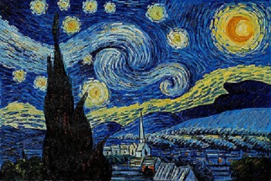
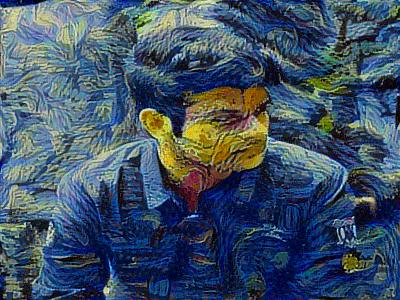

# Neural Style Transfer
---

This repository transfers a content image into an artwork style by applying the idiosyncracies of a given style image into the content image.

For example:- 

### Content Image

### Style Image

### Final Output

---

# Steps for Interacting with the Repo

1. In your git bash, run the following command :-

		git clone https://github.com/kunalyadav0954/Neural_style_transfer.git
		cd Neural_style_transfer
		
2. Save your content image in the folder `images/content/` and the style image in the folder `images/style/` 

3. Download the pretrained vgg-19 model from the following link : [imagenet-vgg-19-verydeep.mat](https://www.vlfeat.org/matconvnet/models/imagenet-vgg-verydeep-19.mat "Pretrained-model") and save it in a folder named `vgg-19_pretrained_model` (Create this folder in the Neural_ style_ transfer directory)

4. In an IDE of your choice, simply import the module nst.py as follows:

		import importlib  # for importing nst again without restarting IDE
		import nst
		 
5. The final output will be stored in the folder `nst_output`You can tweak the parameters like, content, style images, style layers, no. of iterations, content layer etc in the CONFIGURE class defined at the start of nst.py :

        class CONFIGURE:
          content_path ='images/content/my_pic.jpg'
          style_path ='images/style/rembrandt.jpg'
          STYLE_LAYERS = [
            ('conv1_2', 0.7),
            ('conv2_2', 0.2),
    		('conv3_4', 0.05),
    		('conv4_4', 0.025),
    		('conv5_4', 0.025)]
  	      # use last layers for style
  		  content_cost_layer = 'conv4_4'   # conv4_4
          num_iterations = 1001
          learning_rate = 1.0
          output_folder = 'nst_output/'	 
          
6. To re-import the module use `nst= importlib.reload(nst)`    

---
# References:

The Neural Style Transfer algorithm was due to Gatys et al. (2015). Harish Narayanan and Github user "log0" also have highly readable write-ups. The pre-trained network used in this implementation is a VGG network, which is due to Simonyan and Zisserman (2015). Pre-trained weights were from the work of the MathConvNet team.

**NOTE**

> The VGG-19 architecture uses maxpool layers, but in this implementation maxpool layers are replaced by averagepool layers as it generates more aesthetically pleasing results 

- Leon A. Gatys, Alexander S. Ecker, Matthias Bethge, (2015). [A Neural Algorithm of Artistic Style](https://arxiv.org/abs/1508.06576) 
- Harish Narayanan, [Convolutional neural networks for artistic style transfer.](https://harishnarayanan.org/writing/artistic-style-transfer/)
- Log0, [TensorFlow Implementation of "A Neural Algorithm of Artistic Style".](http://www.chioka.in/tensorflow-implementation-neural-algorithm-of-artistic-style)
- Karen Simonyan and Andrew Zisserman (2015). [Very deep convolutional networks for large-scale image recognition](https://arxiv.org/pdf/1409.1556.pdf)
- [MatConvNet.](http://www.vlfeat.org/matconvnet/pretrained/)
      